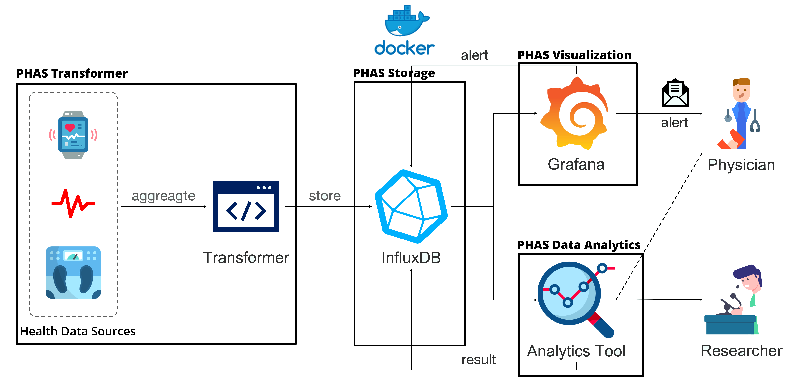

 
# PHAS: An End-to-End, Open-Source, and Portable Healthcare Analytics Stack  
PHAS is a new shared-knowledge and time-series-aware framework, the crucial goal of which is to enhance the development of healthcare data analytics by providing neccessary tools to researchers.

## Architecture  

## Tech Stack  

**Data Source and Transformer:** Jupyter notebook

**Storage:** InfluxDB

**Visualization:** Grafana

**Data Analytics:** Jupyter notebook

## Features  

- **Portable:** It can be easily run on local laptop or deployed on a server.
- **Easy Knowledge Sharing:** The whole docker container, the implemented jupyter codes, or the created Grafana Dashboards/Panels can be easily shared with others preventing re-inventing the wheels. 
- **Easy To Learn:** The tools provided are the one's mostly used by researchers. For Example the jupyter notebooks are provided so that researchers can easily write down their codes in python using libraries they are already using. And we selected Grafana as Visualization component because there are lots of pre-built dashboards open-source that can be re-uesd or knowing a little bit about js and InfluxDB query language, they can easily create new desired charts.
- **Cross platform:** The docker container can easily be setup on every operating systems. 

## Run Locally  

Clone the project  

~~~bash  
  git clone https://github.com/HealthSciTech/PHAS.git
~~~

Go to the project directory  

~~~bash  
  cd PHAS
~~~

The instruction and codes will be uploaded soon!